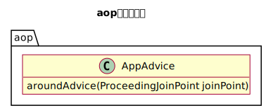
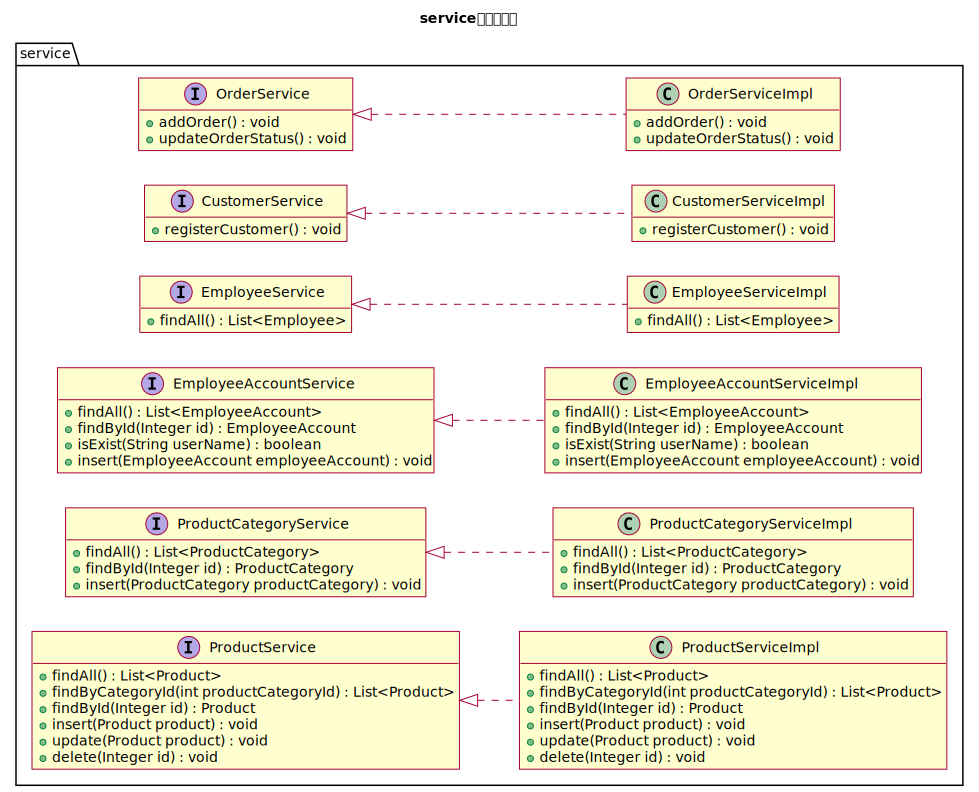
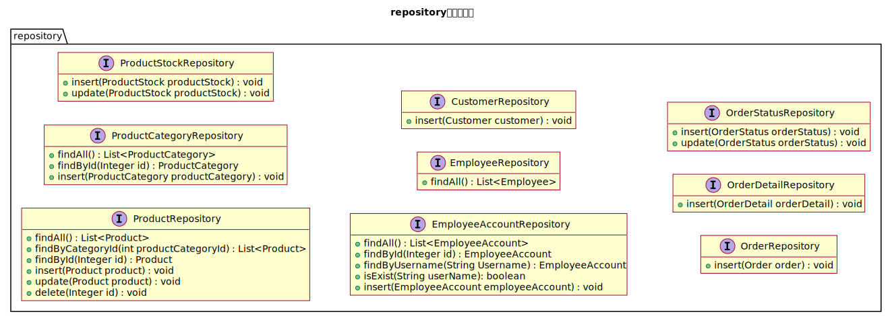
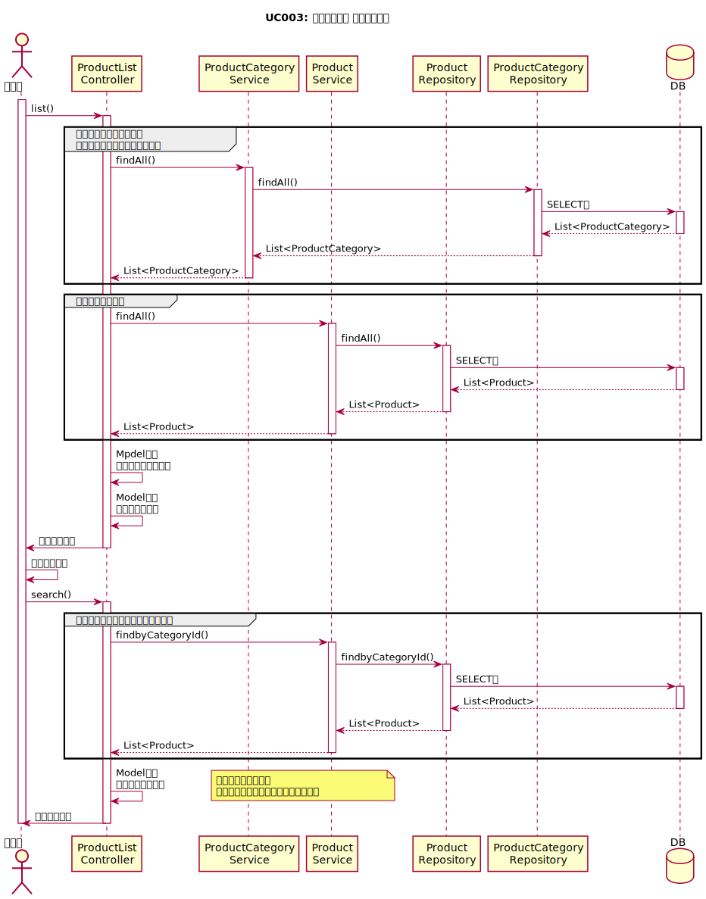
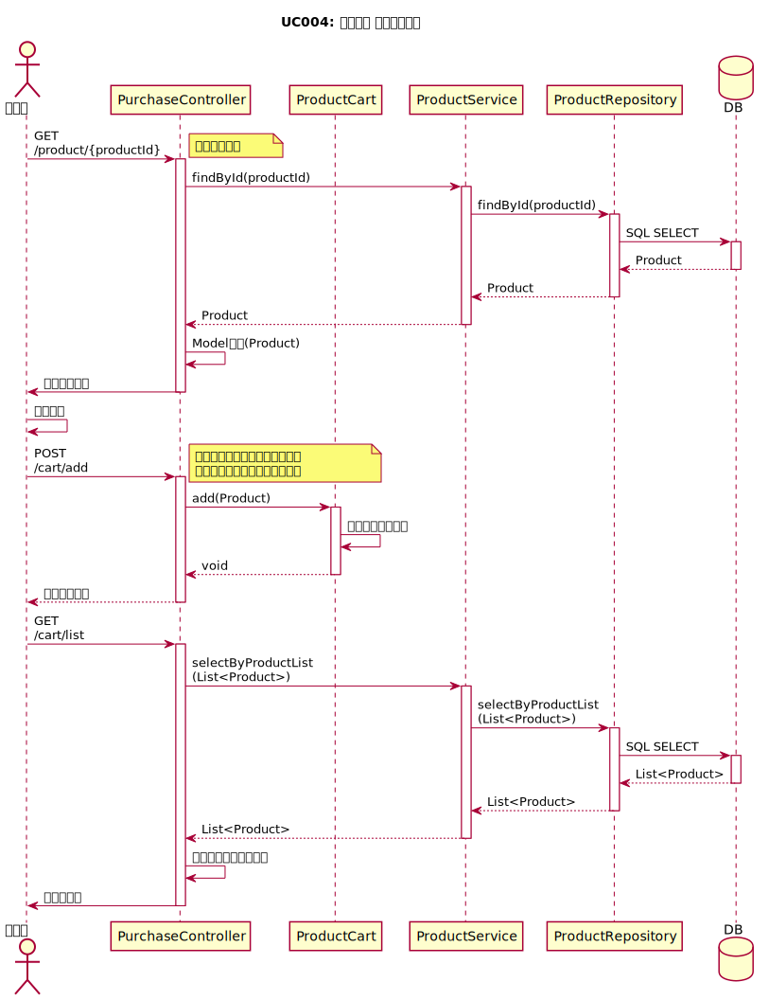
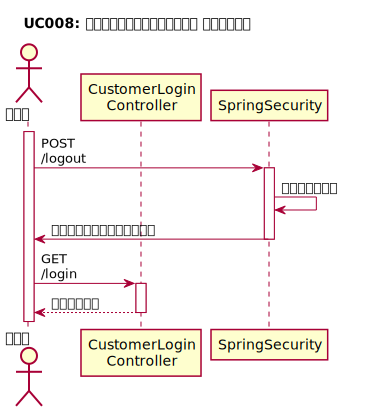
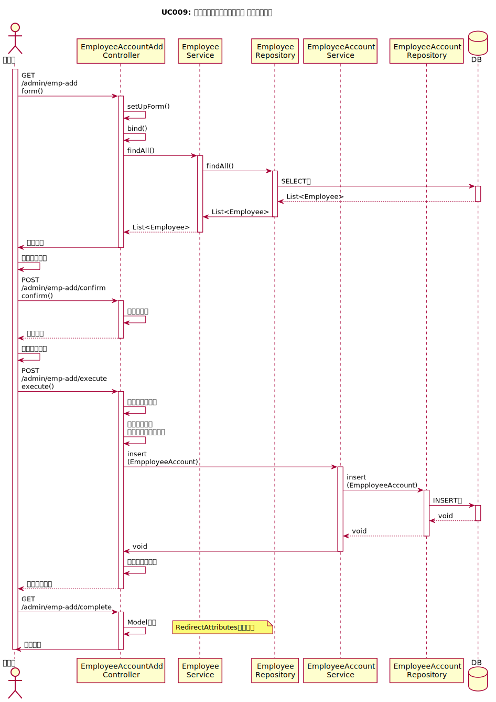
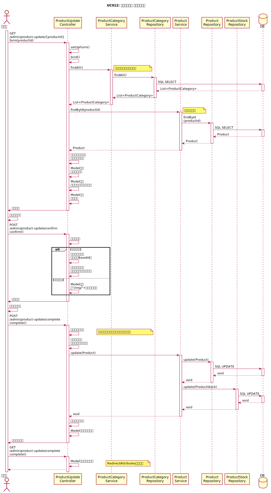
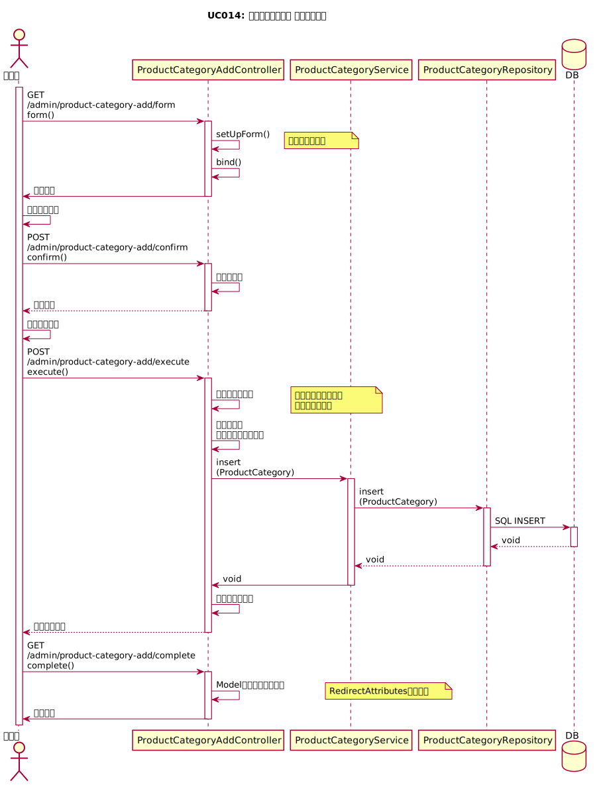

# Fullness Stationary社 文具/雑貨販売システム

## リモートトンネルURL

https://vscode.dev/tunnel/mbp14local/Users/imagepit/Dropbox/repo/fullness-ec

## チームメンバー

- 高橋良輔（チームリーダー兼テクニカルリーダー）

## システム名

**Fullness Stationary社 文具/雑貨販売システム**

パッケージ名は`com.fullness.ec`とする。

## 機能一覧

### フロントエンド機能

機能ID|機能名|説明
---|---|---
UC001| アカウント登録 | 顧客がシステムを利用するための認証アカウントを登録する
UC002| ログイン | 顧客がシステムを利用する資格を有していることを認証によって確認する
UC003| カテゴリ別商品検索 | 選択されたカテゴリに属する商品を一覧形式で表示する
UC004| 商品購入 | 選択された商品の注文数を入力してカートに入れる
UC005| 購入確定 | 支払い方法を選択して購入を確定する
UC006| 購入キャンセル | カートの商品の一部またはすべてをキャンセルする
UC007| 購入履歴閲覧 | 顧客の過去の購入履歴を一覧形式で表示する 
UC008| ログアウト | システムからログアウトする

### バックエンド機能

機能ID|機能名|説明
---|---|---
UC009| 担当者アカウント登録 | 担当者がシステムを利用するための認証アカウントを登録する
UC010| 新商品登録 | 新しく販売する商品情報を登録する
UC011| 商品検索 | 選択されたカテゴリに属する商品を一覧形式で表示する
UC012| 商品修正 | UC011の検索結果画面で選択された商品に関する情報を変更する
UC013| 商品削除 | UC011の検索結果画面で選択された商品に関する情報を削除する
UC014| カテゴリ登録 | 新しい商品カテゴリを登録する
UC015| 購入履歴検索 | 購入日または顧客のアカウントで購入履歴を検索する
UC016| 配送手続き | 配送した商品のステータスを変更する
UC017| 担当者ログイン | システムを利用する資格を有している担当者かを認証によって確認する
UC018| 担当者ログアウト | システムからログアウトする

## 開発フェーズについて

**初期開発フェーズ**

初期開発フェーズとして下記機能を開発する。

＜バックエンド機能＞

機能ID|機能名|説明
---|---|---
UC009| 担当者アカウント登録 | 担当者がシステムを利用するための認証アカウントを登録する
UC010| 新商品登録 | 新しく販売する商品情報を登録する
UC011| 商品検索 | 選択されたカテゴリに属する商品を一覧形式で表示する
UC012| 商品修正 | UC011の検索結果画面で選択された商品に関する情報を変更する
UC013| 商品削除 | UC011の検索結果画面で選択された商品に関する情報を削除する
UC014| カテゴリ登録 | 新しい商品カテゴリを登録する
UC017| 担当者ログイン | システムを利用する資格を有している担当者かを認証によって確認する
UC018| 担当者ログアウト | システムからログアウトする

**次期開発フェーズ**

次期開発フェーズとして下記機能（残り全て）を開発する。

＜バックエンド機能＞

機能ID|機能名|説明
---|---|---
UC015| 購入履歴検索 | 購入日または顧客のアカウントで購入履歴を検索する
UC016| 配送手続き | 配送した商品のステータスを変更する

＜フロントエンド機能＞

機能ID|機能名|説明
---|---|---
UC001| アカウント登録 | 顧客がシステムを利用するための認証アカウントを登録する
UC002| ログイン | 顧客がシステムを利用する資格を有していることを認証によって確認する
UC003| カテゴリ別商品検索 | 選択されたカテゴリに属する商品を一覧形式で表示する
UC004| 商品購入 | 選択された商品の注文数を入力してカートに入れる
UC005| 購入確定 | 支払い方法を選択して購入を確定する
UC006| 購入キャンセル | カートの商品の一部またはすべてをキャンセルする
UC007| 購入履歴閲覧 | 顧客の過去の購入履歴を一覧形式で表示する 
UC008| ログアウト | システムからログアウトする

## 成果物

納品時に下記を成果物として提出する。

### 内部（詳細）設計

- クラス図
- シーケンス図
- テスト仕様書
    - 単体テスト
        - Repository
        - Service
        - （出来れば）Controller
    - 結合テスト
        - ブラックボックステスト
        - 画面毎にシートを作成
            - 表示項目の確認
            - 入力・出力の確認
            - 画面遷移の確認
- ソースコード
- テストプログラム（JUnitクラスでの単体テストコード）
- Javadocドキュメント
- jarファイル（リリース時）
- 発表資料

## プロジェクト構成

下記のプロジェクト構成は全チーム統一します。

```
├── build.gradle
├── src
│   ├── main
│   │   ├── java
│   │   │   └── com
│   │   │       └── fullness
│   │   │           └── ec
│   │   │               ├── EcApplication.java
│   │   │               ├── advice
│   │   │               |   └── （AOPクラス）
│   │   │               ├── config
│   │   │               |   └── （Configクラス）
│   │   │               ├── service
│   │   │               |   └── （サービスクラス）
│   │   │               ├── controller
│   │   │               |   └── （コントローラークラス）
│   │   │               ├── entity
│   │   │               |   └── （エンティティクラス）
│   │   │               ├── repository
│   │   │               |   └── （リポジトリクラス）
│   │   │               ├── form
│   │   │               |   └── （フォームクラス）
│   │   │               ├── exception
│   │   │               |   └── （独自例外クラス）
│   │   │               └── security
│   │   │                   └── （Spring Security関連クラス）
│   │   └── resources
│   │       ├── ValidationMessages.properties
│   │       ├── application.properties
│   │       ├── com
│   │       │   └── fullness
│   │       │       └── ec
│   │       │           └── repository
│   │       ├── db
│   │       │   ├── create_table.sql
│   │       │   └── create_user.sql
│   │       ├── messages.properties
│   │       └── templates
│   │           └── （テンプレートファイル）
│   └── test
│       └── java
│           └── com
│               └── fullness
│                   └── com
│                       ├── EcApplicationTests.java
│                       ├── repository
│                       │   └── （リポジトリのテストクラス）
│                       └── service
│                           └── （サービスのテストクラス）
├── doc
│   └── （JavaDoc生成）
├── plan
│   ├── diagram
│   │   ├── クラス図.png
│   │   └── シーケンス図.png
│   ├── wbs
│   │   └── wbs.xlsx
│   ├── db
│   │   ├── db.sql <-- DB&ユーザ定義(DB名:fullness_ec ユーザ･パスワード:fullness_ec)
│   │   ├── schema.sql  <-- テーブル定義SQL
│   │   └── data.sql  <-- 初期データSQL
│   ├── test
│   │   ├── 単体テスト.xlsx <-- 単体テスト仕様書
│   │   └── 結合テスト.xlsx <-- 結合テスト仕様書
│   └── etc
│       ├── ソースファイル一覧
│       └── （その他チームで作成したもの）
├── README.md
└── .gitignore
```

## 画面遷移

[ソースはこちら](plan/diagram/screen/screen.puml)


## 画面仕様

[画面仕様一覧](plan/diagram/screen/screen.md)

画面ID | 画面名
---|---
P001 | メニュー
P002 | 担当者ログイン
P003 | アカウント登録(入力)
P004 | アカウント登録(確認)
P005 | アカウント登録(完了)
P006 | 商品検索
P007 | 商品削除(確認)
P008 | 商品削除(完了)
P009 | 商品修正(入力)
P010 | 商品修正(確認)
P011 | 商品修正(完了)
P012 | 新商品登録(入力)
P013 | 新商品登録(確認)
P014 | 新商品登録(完了)
P015 | 購入履歴検索
P016 | 配送手続き(入力)
P017 | 配送手続き(確認)
P018 | 配送手続き(完了)
P019 | 商品カテゴリ登録(入力)
P020 | 商品カテゴリ登録(確認)
P021 | 商品カテゴリ登録(完了)

## ER図

[SQLはこちら](plan/db/schema.sql)


## クラス図

### パッケージ全体


### AOPパッケージ



### コンフィグパッケージ


### コントローラーパッケージ


### フォームパッケージ


### サービスパッケージ



### リポジトリパッケージ



### エンティティパッケージ


## シーケンス図

### UC001 顧客ログイン


### UC002 顧客登録


### UC003 商品検索



### UC004 商品購入



### UC005 購入確定


### UC006 注文ステータス更新


### UC007 購入履歴閲覧


### UC008 顧客アカウントログアウト



### UC009 社員アカウント登録機能



### UC010 新商品登録機能


### UC011 商品検索機能


### UC012 商品修正機能



### UC013 商品削除機能


### UC014 商品カテゴリ登録機能



### UC017 社員アカウントログイン機能


### UC018 社員アカウントログアウト機能


## 設計・開発・納品の流れ

1. 要求、要件の確認
    - 要件定義、基本設計書などの読み込み、仕様を理解する
    - 不明な点や確認したい点を纏める
        - 次の「客先訪問」で質問する内容を洗い出す
2. 客先訪問
    - お客様に訪問し仕様・要件の確認を行う
        - お客様の認識と齟齬がないかをしっかり確認する
3. 詳細設計
    - クラス図、シーケンス図、単体テスト仕様書、結合テスト仕様書を作成
    - 作成し、チーム内でのレビューが完了したら上司レビューを行う
4. 開発
    - 設計書を見ながら作業分担し実装を行う
    - 単体テストは並行して行う
5. 上司の最終チェック
    - 全ての成果物が完成し、単体テスト、結合テストも終わり、その他の成果物も揃い、チーム内でレビューし問題ないと判断した場合は上司に連絡する
    - こちらも20分前に上司にSlackに連絡をとりレビュー予約をとる
6. 納品
    - 上司の最終チェックが終了したら納品作業を行う
    - ソースコードはjarファイルにアーカイブ化しGithubのリリースファイルとしてアップロードする
7. 新規開発
    - 1次フェーズの納品が完了

## 客先訪問、上司レビュー、上司報告時のルール

**レビュー前**

- レビュー希望時間の20分前には上司にSlackに連絡をとりレビュー予約をとる
- レビューまでにはレビューする対象の成果物はGithubにプッシュする
    - ソースコードの場合は**必ずSpringBootが起動する状態にすること**
    - お客に見せても恥ずかしくないよう成果物は綺麗で見やすい状態にする

**レビュー時**

- 相手に対して話す内容を簡潔にわかりやすく説明する
- 相手が発言した内容をしっかりメモをとる

## 日次の上司報告について

- 毎日16時には上司レビューを行います（10分程度）
- WBSを見せながら主に進捗状況について上司に報告する
- 上司の発言した内容はしっかりメモをとる

## pugの使い方

gulp関連をグローバルインストールしてリンクを追加する

```bash
npm i -g gulp gulp-sass sass gulp-plumber gulp-notify gulp-pug gulp-autoprefixer
npm link gulp gulp-sass sass gulp-plumber gulp-notify gulp-pug gulp-autoprefixer
```

下記コマンドを実行したらgulpによる監視が開始される

```bash
gulp
```

## Selenide + Allureのテスト

_テストの実行_

```bash
./gradlew allureReport --depends-on-tests
```

_レポートの表示_

```bash
./gradlew allureServe
```