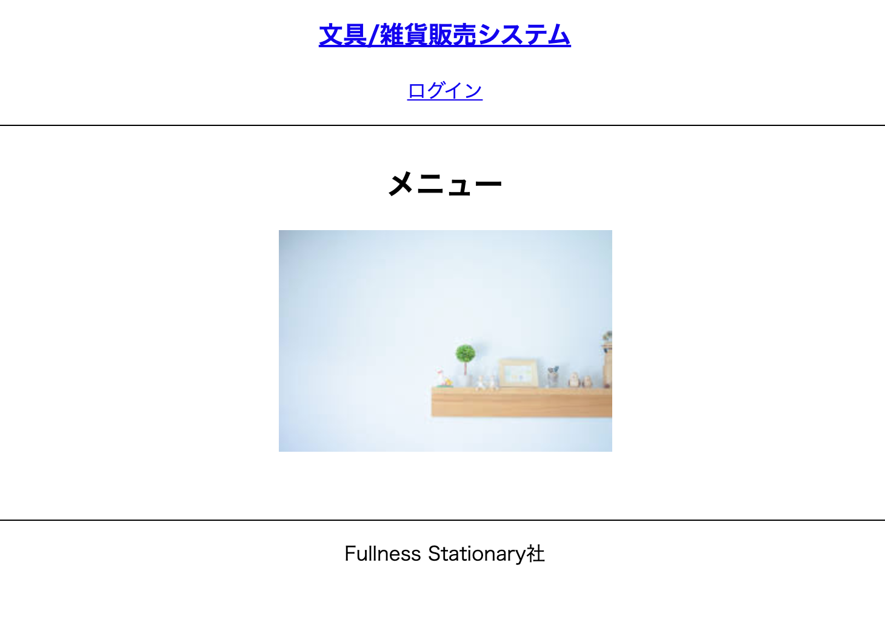
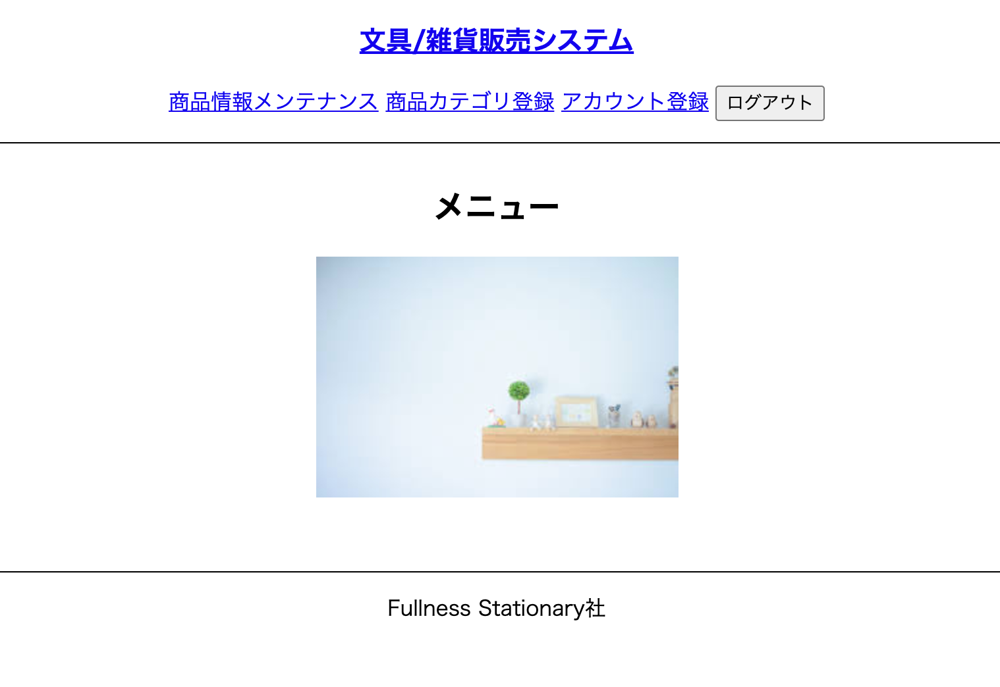
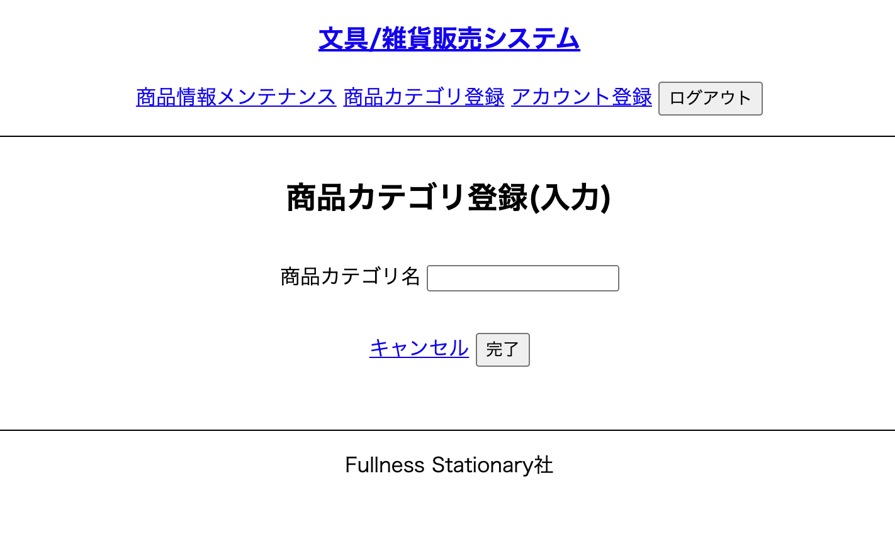
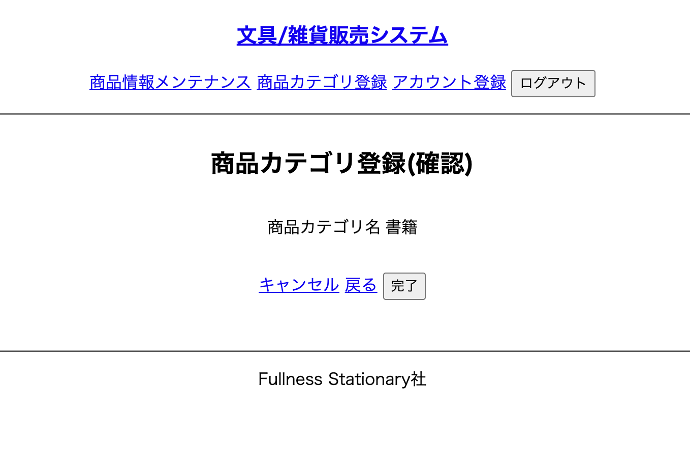
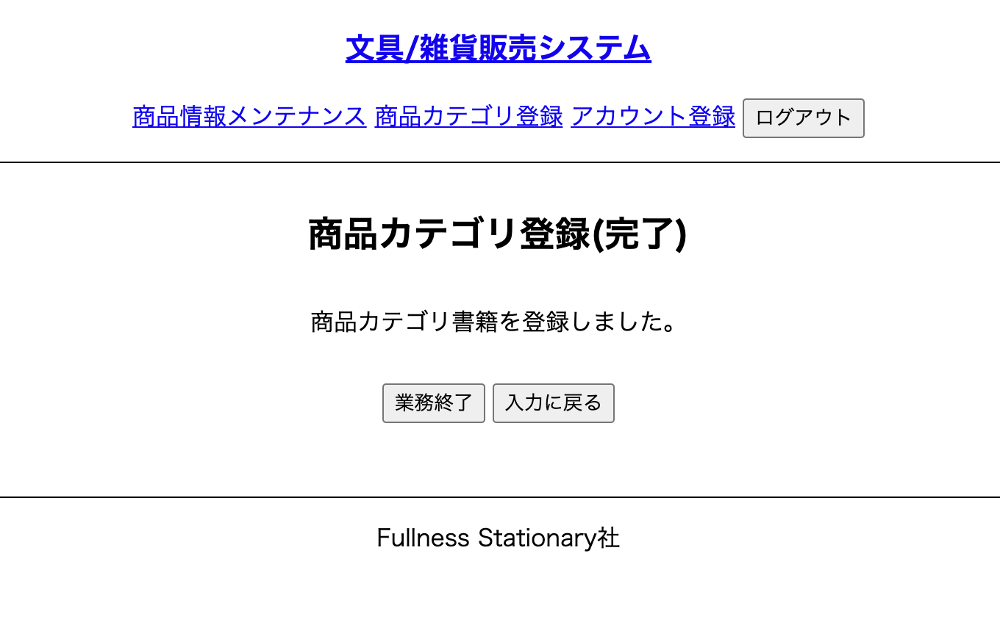

# 画面仕様一覧

## P001

**ログイン前**

**ログイン後**

## P002 担当者ログイン

（準備中）

## P003 アカウント登録(入力)

（準備中）

## P004 アカウント登録(確認)

（準備中）

## P005 アカウント登録(完了)

（準備中）

## P006 商品検索

（準備中）

## P007 商品削除(確認)

（準備中）

## P008 商品削除(完了)

（準備中）

## P009 商品修正(入力)

（準備中）

## P010 商品修正(確認)

（準備中）

## P011 商品修正(完了)

（準備中）

## P012 新商品登録(入力)

（準備中）

## P013 新商品登録(確認)

（準備中）

## P014 新商品登録(完了)

（準備中）

## P015 購入履歴検索

（準備中）

## P016 配送手続き(入力)

（準備中）

## P017 配送手続き(確認)

（準備中）

## P018 配送手続き(完了)

（準備中）

## P019 商品カテゴリ登録(入力)

## P020 商品カテゴリ登録(確認)

## P021 商品カテゴリ登録(完了)

